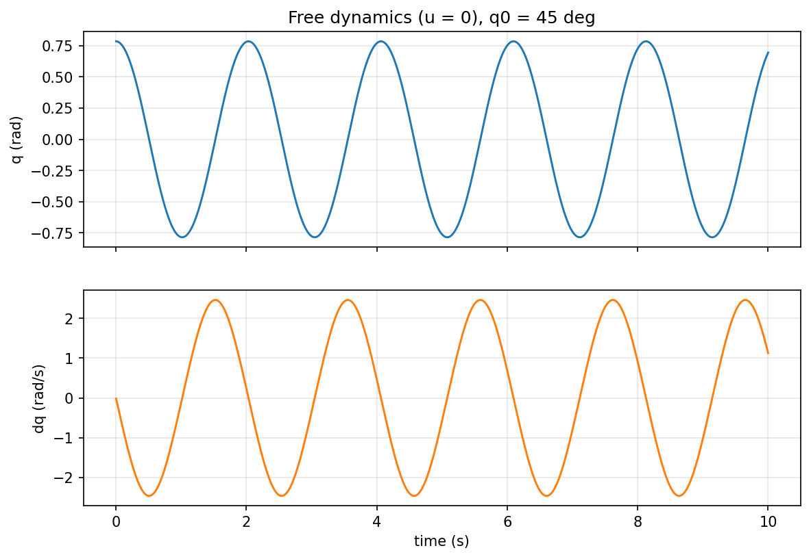
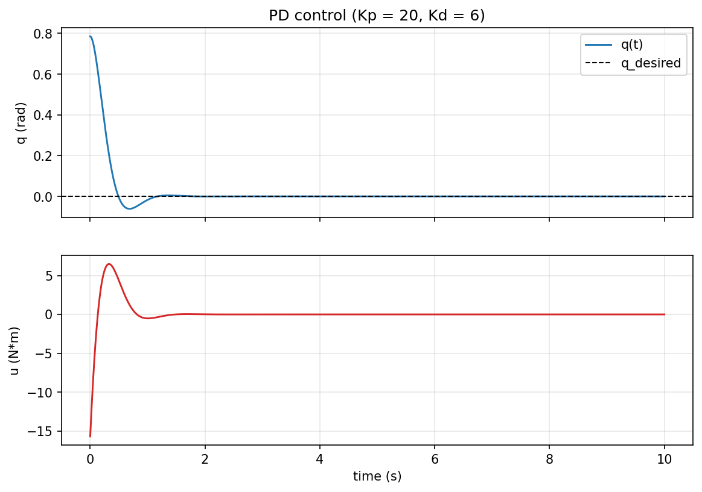
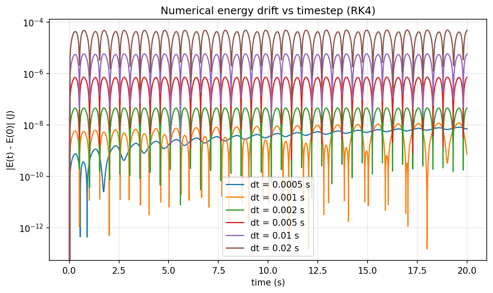

# Project 1 · MuJoCo Pendulum Dynamics & Control Lab

一个完整的 MuJoCo 单摆动力学与控制实验项目：**建模 → 动力学仿真 → 自由摆动 → PD 控制 → 能量分析 → 参数扫描 → 实验报告**。

设计意图：不照教程"跑一遍 pendulum"，而是建立一个小型 robotics project —— 有明确的输入、状态、控制、实验、测试和结果分析。它刻意补齐 youBot 项目（SE(3) 运动学 + NextState 仿真）中没有深入的部分：**物理参数（质量/惯量/重力）、连续动力学、数值积分**。

---

## 1. 你要掌握的核心对象

| 对象 | 含义 | 本项目中 |
|---|---|---|
| `mujoco.MjModel` | 机器人的**结构**：body / joint / geom / mass / inertia / actuator / option | `model = load_model()` |
| `mujoco.MjData` | 机器人的**当前状态**：qpos / qvel / ctrl / time / energy | `data = create_data(model)` |
| `qpos` | 广义坐标，单摆里 `qpos = [q]`（摆角 rad） | `data.qpos[0]` |
| `qvel` | 广义速度，单摆里 `qvel = [dq]` | `data.qvel[0]` |
| `ctrl` | 执行器输入，单摆里 `ctrl = [u]`（力矩 N·m） | `data.ctrl[0]` |
| `mj_step(model, data)` | 推进一次物理仿真 | 核心循环 |

核心循环（与 youBot 的 `NextState()` 循环同构，只是积分交给 MuJoCo）：

```
read q, dq  →  controller(q, dq, t) → u  →  data.ctrl = u  →  mj_step()  →  log
```

## 2. 目录结构

```
01_pendulum/
├── model/
│   └── pendulum.xml          # MJCF 模型：hinge 关节 + 电机，q=0 为竖直下垂
├── src/
│   ├── model.py              # load_model() / create_data() / print_model_info()
│   ├── simulation.py         # run_simulation() —— 统一仿真 API（自由/恒力矩/PD 复用）
│   ├── controller.py         # pd_control() + PDController
│   ├── logger.py             # DataLogger：逐 step 记录 time/q/dq/u，CSV 读写
│   ├── energy.py             # 动能 / 势能 / 总能量（与 data.energy 完全一致）
│   ├── metrics.py            # settling time / overshoot / RMS error / control effort
│   └── visualization.py      # 绘图 + pendulum 动画视频（matplotlib → mp4）
├── experiments/
│   ├── 00_viewer.py          # Milestone 1：加载模型并打开 viewer
│   ├── 01_free_dynamics.py   # Milestone 2：自由动力学（45° 主实验 + 15/30/60° 对比）
│   ├── 02_constant_torque.py # Experiment B：恒力矩 → 平衡角漂移
│   ├── 03_pd_control.py      # Milestone 3 + 5：PD 控制、Kp×Kd 扫描、视频
│   └── 04_energy_analysis.py # Milestone 4：机械能守恒与数值漂移
├── tests/                    # pytest：模型 / 仿真 / 控制器（20 个用例）
├── outputs/
│   ├── csv/                  # 所有实验的时间序列数据
│   ├── plots/                # 所有结果图（PNG）
│   └── videos/               # pd_control.mp4
├── requirements.txt
└── README.md
```

## 3. 环境安装

```powershell
py -m pip install -r requirements.txt
```

> 只用官方 `pip install mujoco`（mujoco 3.x），不使用已废弃的 `mujoco-py`。

## 4. 快速开始

```powershell
# Milestone 1：打开交互式 viewer，确认模型能显示
py experiments/00_viewer.py

# Milestone 2：自由动力学 → outputs/csv/free_dynamics.csv + 图
py experiments/01_free_dynamics.py

# Experiment B：恒力矩平衡
py experiments/02_constant_torque.py

# Milestone 3 + 5：PD 控制、Kp×Kd 全扫描、指标表、视频
py experiments/03_pd_control.py

# Milestone 4：能量守恒 + 积分步长漂移
py experiments/04_energy_analysis.py

# 测试
py -m pytest tests -v
```

脚本内部通过 `__file__` 定位项目根目录，**在任意工作目录下运行均可**。

## 5. 实验结果概览

### 5.1 自由动力学（Milestone 2）

从 45° 释放（u = 0），无阻尼振荡，周期随摆角增大而变长（非线性摆特性）：

| q0 | 周期（s） |
|---|---|
| 15° | 1.962 |
| 30° | 1.988 |
| 45° | 2.032 |
| 60° | 2.097 |

小角度理论周期 2π√(I / m·g·Lc) ≈ 1.92 s，与 15° 结果接近；摆角越大偏离越大。



### 5.2 恒力矩平衡（Experiment B）

恒定力矩 u 使摆停在新平衡角 q\*，由力矩平衡 `m·g·Lc·sin(q*) = u` 解析预测，与实测高度吻合：

| u (N·m) | q\* 实测 (rad) | q\* 预测 (rad) |
|---|---|---|
| 0.5 | 0.061 | 0.060 |
| 1.0 | 0.122 | 0.120 |
| 2.0 | 0.247 | 0.242 |

### 5.3 PD 控制（Milestone 3）

控制律：`u = Kp·(qd − q) − Kd·dq`，目标 qd = 0，初始 45°。

- **Kp 扫描**（Kd = 1）：Kp 越大响应越快，但超调增大（Kp=1→54.6%，Kp=20→72.0%）
- **Kd 扫描**（Kp = 10）：Kd 越大阻尼越强（Kd=0.1 时 10 s 内不收敛、超调 96%；Kd=2 时 3.53 s 收敛、超调 42%）

调优组合 **Kp = 20, Kd = 6**：settling time **1.06 s**，overshoot **7.8%**，RMS error 0.104。



完整 4×4 扫描指标见 `outputs/csv/pd_metrics.csv`（settling time 热力图为 `outputs/plots/pd_metrics.png`）。

### 5.4 能量分析（Milestone 4）

动能 `T = ½·dqᵀ·M·dq`，势能 `V = Σ mᵢ·g·z_comᵢ`（与引擎 `data.energy = [势能, 动能]` 逐点一致）。RK4 下 20 s 自由摆最大能量漂移：

| dt (s) | max \|E(t)−E(0)\| (J) |
|---|---|
| 0.0005 | 8.1e-9 |
| 0.002 | 4.6e-8 |
| 0.01 | 5.9e-6 |
| 0.02 | 4.9e-5 |



## 6. 与后续路线的关系

```
youBot (SE(3) FK/Jacobian/轨迹/反馈控制/NextState)
   └──> 本 Project 1 (MJCF/物理参数/连续动力学/mj_step/PD/能量)
          └──> Project 2 CartPole (状态空间 + 控制)
                └──> Panda (运动学 + 动力学 + 操作空间控制)
                      └──> MuJoCo + Gymnasium + RL (TD / Q-learning / Policy Gradient / PPO)
```
